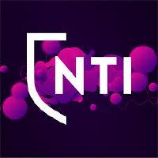

    

<h1 align="center">Awesome NTI</h1>

The following is a collection of projects made   by students at NTI Gymnasiet Stockholm

 

## How do I add my project?
Click [here](https://github.com/nti-stockholm/awesome-nti-stockholm/issues/new?assignees=alvarlagerlof&labels=new+project&template=new-project.md&title=I+want+to+add+my+project+to+the+list) to add your project to this list

## Final projects (Gymansiearbeten)
- [Formux](https://github.com/formux-dev/info) - An experiment with A/B testing in forms. By [alvarlagerlof](https://github.com/alvarlagerlof), [Fiug404](https://github.com/Figu404)
- [RoomSeeker](https://github.com/VirreV/RoomSeeker) - Software to make navigation simpler in school. By [VirreV](https://github.com/VirreV)

## Projects in this repo
- [nti-lan](https://github.com/olvrb/nti-lan) - Booking service for NTI lan parties. By [olvrb](https://github.com/olvrb)
- [web-docs](https://github.com/nti-stockholm/web-docs) - Some links and info usefull for web development. By [alvarlagerlof](https://github.com/alvarlagerlof)
- [tetris](https://github.com/asplunds/tetris) - Simple Tetris web canvas game made in Typescript. By [asplunds](https://github.com/asplunds)
- [denoot](https://github.com/Denoot/denoot) - Backend web framework and router for Deno. By [asplunds](https://github.com/asplunds) & [PumpedSardines](https://github.com/PumpedSardines)
- [pathfinding](https://github.com/PumpedSardines/pathfinding) - A* pathfinding project using canvas. By [PumpedSardines](https://github.com/PumpedSardines)
